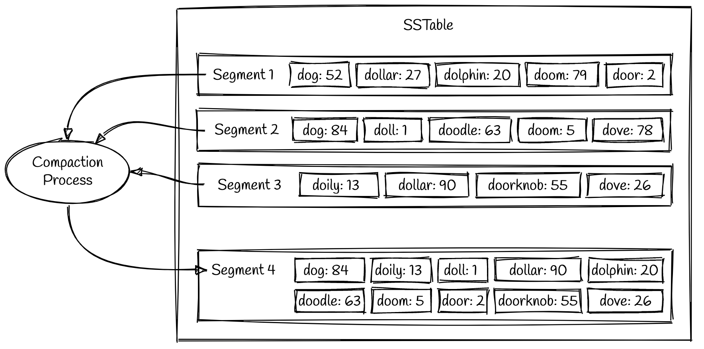
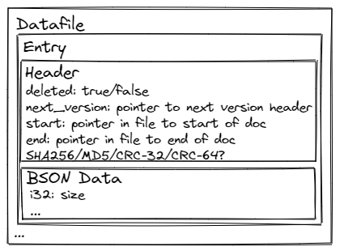

# Working Data Structure
```
[key]           ! 64 byte max
[value] _> 
    this can only be metadata only! 
    pointers to actual table data will need to be stored elsewhere!
{
    timestamp,  u64 ->  8 byte
    deleted,    u8  ->  1 byte (stored as u64 for uniformity / read speed)
    segment,    u64 ->  8 byte
    length,     u64 ->  8 byte
}

Min/Min Table Size:
5 * 8 = 40 Bytes + Data Size

Min/Max Table Size
4 * 8 = 32 + 64  = 96 bytes + Data Size

At the larges 1bn rows = 96GB of data, roughly half for the min value
```

# LSM/LSMT (Log Structured Merge Tree)
This defines a way to represent a tree (indexed data) structure on disk as well as the compaction mechanisms to facilitate such operations.

## Segment Files & Compaction


# StackOverflow - Summary of Qualities
I know I need the following qualities:
- Easy skipping of documents
- Ability to verify integrity of individual document data? Might be better to validate file integrity
- Easily append binary data
- Can mark entries as deleted for later compaction of the file / full removal of the data
- Data is versioned by itself to allow for a self auditing trail of documents
  

# Terms
* [Bloom Filter](https://yetanotherdevblog.com/bloom-filters/)
* [Dense & Sparse Indexes](https://yetanotherdevblog.com/dense-vs-sparse-indexes/)
* [LSM/LSMT (Log Structured Merge Tree)](https://yetanotherdevblog.com/lsm/)
* Execution Plan
* B+Tree (Binary Plus Tree)
* Materialized Views
* MVCC (Multi Version Concurrency Control)
* Raft

# References
https://github.com/wspeirs/btree
https://yetanotherdevblog.com/bloom-filters/
https://yetanotherdevblog.com/dense-vs-sparse-indexes/
https://yetanotherdevblog.com/lsm/